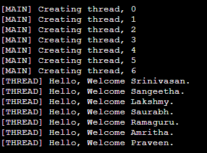
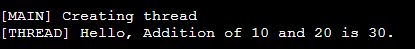

# 20CYS281 - Operating System Lab 
  

## MultiThreading

**MultiThreading** is a form of Multitasking where concurrent execution of the program happens. _Process-based_ and _thread-based_ concurrent executions or multitasking are supported. In process-based, it is concurrent execution of the programs whereas in thread-based concurrent execution of parts of the same program. 

## MultiThreading in C 

C doesn't support Multithreading. Only through **POSIX Standards for threads (pthread)** implementations are available. 

### Header file
```
#include <pthread.h>
```

### Function 
```
pthread_create(&thread_id, attr, myFunc, parameters);
```

- &thread_id - pointer to thread_id 
- attr - thread attributes or NULL for default attributes
- myFunc - Function to be called once the thread is created
- parameters - parameters to the function (myFunc) called or NULL 

### Example 

```
/*
@Author: Ramaguru Radhakrishnan
@Date: 30 - Dec - 2022
@Description: Creation and Execution of a simple thread using single parameter
*/
#include <pthread.h>
#include <stdlib.h>
#include <stdio.h> 
#include <unistd.h>

void *summaclassdemo(void *args) {
    
    printf("Welcome to the thread");
    
}

int main() {
    
    pthread_t thread; // A thread ID is assigned
    
    printf("%ld\n", thread);
    
    // pthread_create(thread_id, thread_attribute/NULL,
    // function,functon_params);
    pthread_create(&thread, NULL, summaclassdemo, NULL);
    
    pthread_join(thread, NULL);
    
    //pthread_exit(NULL);
    return 0; 
}
```

### Example Program 1 - Passing Single Parameter

```
/*
@Author: Ramaguru Radhakrishnan
@Date: 21 - Dec - 2022
@Description: Creation and Execution of a simple thread using single parameter
*/

#include <pthread.h>
#include <stdlib.h>
#include <stdio.h> 
#include <unistd.h>

// printWelcomeMessage will be called when the Thread is created in the main function 
// which takes string as an argument
void *printWelcomeMessage(void *names) {
    
   sleep(2);    
   char *name = (char *)names;    
   printf("\n[THREAD] Hello, Welcome %s.", name);
   pthread_exit(NULL);
   
}

int main () {

   // thread defintion
   pthread_t threads[7];
   
   // parameter to be passed to the called function - printWelcomeMessage
   char names[10][15] = {"Amritha","Praveen","Saurabh","Sangeetha","Lakshmy","Srinivasan","Ramaguru"};
   
   int result;
   
   for(int i = 0; i < 7; i++ ) {
   
      printf("\n[MAIN] Creating thread, %d", i);
      
      // Creating the threading and thus calling the function with parameter passed to it
      result = pthread_create(&threads[i], NULL, printWelcomeMessage, (void *)names[i]);
      
      if (result) {
      
         printf("Error in creating thread, %d ", result);
         exit(-1);
      }
      
   }
   
   // Exit the thread
   pthread_exit(NULL);
}
```

#### Output

<p align="center">
    
</p>

### Example Program 2 - Passing Multiple Parameters

```
/*
@Author: Ramaguru Radhakrishnan
@Date: 21 - Dec - 2022
@Description: Creation and Execution of a simple thread using multiple parameters
*/

#include <pthread.h>
#include <stdlib.h>
#include <stdio.h> 
#include <unistd.h>

// We should use structure to pass multiple arguments to a thread function
struct funcargs {

    int a;
    int b;
    
};

// addition will be called when the Thread is created in the main function 
// which takes structure as an argument
void *addition(void *args) {
    
   sleep(2);    
   struct funcargs *vars = (struct funcargs *)args;    
   printf("\n[THREAD] Hello, Addition of %d and %d is %d.", vars->a, vars->b, vars->a + vars->b);
   pthread_exit(NULL);
   
}

int main () {

   // thread defintion
   pthread_t threads;
   
   // parameter to be passed to the called function - funcargs
   struct funcargs vars;
   
   vars.a = 10;
   vars.b = 20; 
   
   int result;
  
   printf("\n[MAIN] Creating thread");

   // Creating the threading and thus calling the function with parameter passed to it
   result = pthread_create(&threads, NULL, addition, (void *)&vars);

   if (result) {

      printf("Error in creating thread, %d ", result);
      exit(-1);
   }
   
   // Exit the thread
   pthread_exit(NULL);
}
```

#### Output

<p align="center">
    
</p>

### Function 

```
pthread_join(thread_id, retval);
```

- thread_id - thread id 
- retval - NULL


### Example Program 3 - Passing Single Parameter and Joining the Threads

```
/*
@Author: Ramaguru Radhakrishnan
@Date: 27 - Dec - 2022
@Description: Creation and Execution of a simple thread using single parameter and joining 
*/

#include <pthread.h>
#include <stdlib.h>
#include <stdio.h> 
#include <unistd.h>

// printWelcomeMessage will be called when the Thread is created in the main function 
// which takes string as an argument
void *printWelcomeMessage(void *names) {
    
   sleep(2);    
   char *name = (char *)names;    
   printf("\n[THREAD] Hello, Welcome %s.", name);
   pthread_exit(NULL);
   
}

int main () {

   // thread defintion
   pthread_t threads[7];
   
   // parameter to be passed to the called function - printWelcomeMessage
   char names[10][15] = {"Amritha","Praveen","Saurabh","Sangeetha","Lakshmy","Srinivasan","Ramaguru"};
   
   int result;
   
   for(int i = 0; i < 7; i++ ) {
   
      printf("\n[MAIN] Creating thread, %d", i);
      
      // Creating the threading and thus calling the function with parameter passed to it
      result = pthread_create(&threads[i], NULL, printWelcomeMessage, (void *)names[i]);
      
      if (result) {
      
         printf("Error in creating thread, %d ", result);
         exit(-1);
      }
      
   }
   
   pthread_join(threads[0], NULL);
   pthread_join(threads[1], NULL);
   pthread_join(threads[2], NULL);
   pthread_join(threads[3], NULL);
   pthread_join(threads[4], NULL);
   pthread_join(threads[5], NULL);
   pthread_join(threads[6], NULL);
   
   // Exit the thread
   pthread_exit(NULL);
}
```

### Example Program 4 - Passing Single Parameter and Joining the Threads

```
/*
@Author: Ramaguru Radhakrishnan
@Date: 31 - Dec - 2022
@Description: Creation and Execution of a simple thread using multiple parameters
*/

#include<pthread.h>
#include<stdlib.h>
#include<stdio.h> 
#include<unistd.h>
#include<string.h>

// We should use structure to pass multiple arguments to a thread function
struct funcargs {

    int rollnumber;
    char name[10];
    int mark1;
    int mark2;
    int mark3;
    int mark4;
    int mark5;
    
};

// addition will be called when the Thread is created in the main function 
// which takes structure as an argument
void *calculateTotal(void *args) {

   struct funcargs *vars = args;    
   printf("\n[THREAD] Hello, The total for %s with Roll Number %d is %d.", vars->name, vars->rollnumber, vars->mark1 + vars->mark2 + vars-> mark3 + vars-> mark4 + vars->mark5);
   pthread_exit(NULL);
   
}

int main () {

   // thread defintion
   pthread_t threads;
   
   // parameter to be passed to the called function - funcargs
   struct funcargs vars;
   
   //printf("\n[Main] %p", vars);
   //printf("\n%p", &vars);
   
   vars.rollnumber = 18;
   strcpy(vars.name,"Ramaguru R");
   vars.mark1 = 99;
   vars.mark2 = 87;
   vars.mark3 = 47;
   vars.mark4 = 78;
   vars.mark5 = 66;
   
   int result;
  
   printf("\n[MAIN] Creating thread");

   // Creating the threading and thus calling the function with parameter passed to it
   result = pthread_create(&threads, NULL, &calculateTotal, (void *)&vars);

   if (result) {

      printf("Error in creating thread, %d ", result);
      exit(-1);
   }
   
   // Exit the thread
   pthread_exit(NULL);
}
```
