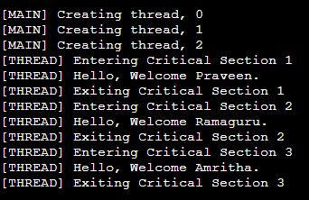

# 20CYS281 - Operating System Lab 
  

## Mutex

Mutex is Mutual Exclusion Object. At any point of time, only one thread can work with the shared resources. In simple words, it is a **locking mechanism.**. 
A thread acquires a mutex when it is entering to access the shared/critical section of the program. The thread releases the mutex when it is exiting the 
shared/critical section of the program. A mutex can either be locked or unlocked which is modified only the process which requested or released the lock.

### Function 

```
pthread_mutex_init(&lock, *attr);
```

- &lock - mutex (defined using _pthread_mutex_t_)
- attr - mutex attributes or NULL for default attributes

```
pthread_mutex_destroy(&lock);
```

- &lock - mutex (that was initialized using _pthread_mutex_init_)

```
pthread_mutex_lock(&lock);
pthread_mutex_trylock(&lock);
pthread_mutex_unlock(&lock);
```

- &lock - mutex (that was initialized using _pthread_mutex_init_)


### Example 1 - Mutex

```
/*
@Author: Ramaguru Radhakrishnan
@Date: 28 - Dec - 2022
@Description: Mutex
*/

#include <pthread.h>
#include <stdlib.h>
#include <stdio.h> 
#include <unistd.h>

// Mutex lock 
pthread_mutex_t lock;

// Counter is the shared resource variable accessed by all threads
int counter;

// printWelcomeMessage will be called when the Thread is created in the main function 
// which takes string as an argument
void *printWelcomeMessage(void *names) {

   // Thread acquiring the lock    
   pthread_mutex_lock(&lock);
   
   char *name = (char *)names; 
   
   printf("\n[THREAD] Entering Critical Section %d", ++counter);
   
   for(int i=0; i<400000000;i++);
   printf("\n[THREAD] Hello, Welcome %s.", name);
   
   printf("\n[THREAD] Exiting Critical Section %d", counter);
   
   // Thread releasing the lock
   pthread_mutex_unlock(&lock);
   
}

int main () {

   // thread defintion
   pthread_t threads[3];
   
   // parameter to be passed to the called function - printWelcomeMessage
   char names[10][15] = {"Amritha","Praveen","Ramaguru"};
   
   // initializing the mutex 
   if (pthread_mutex_init(&lock, NULL) != 0)
    {
        printf("\n mutex init failed\n");
        return 1;
    }
   
   int result;
   
   for(int i = 0; i < 3; i++ ) {
   
      printf("\n[MAIN] Creating thread, %d", i);
      
      // Creating the threading and thus calling the function with parameter passed to it
      result = pthread_create(&threads[i], NULL, printWelcomeMessage, (void *)names[i]);
      
      if (result) {
      
         printf("Error in creating thread, %d ", result);
         exit(-1);
      }
      
   }
   
   pthread_join(threads[0], NULL);
   pthread_join(threads[1], NULL);
   pthread_join(threads[2], NULL);
   
   // destroying the mutex 
   pthread_mutex_destroy(&lock);

}
```

#### Output

<p align="center">
    
</p>

